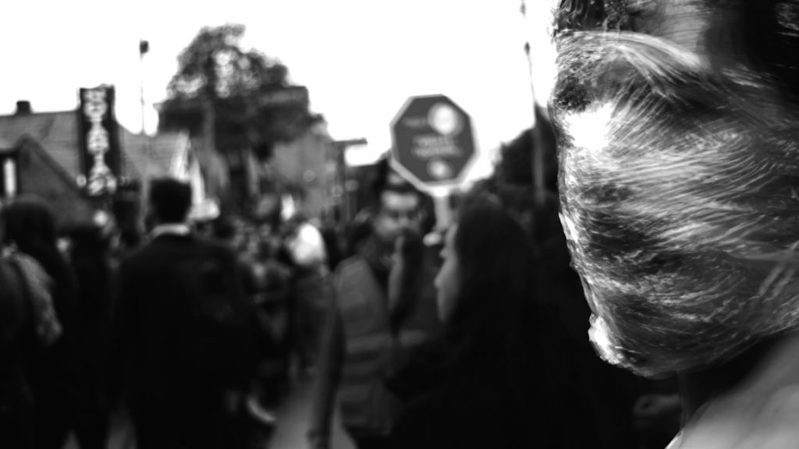
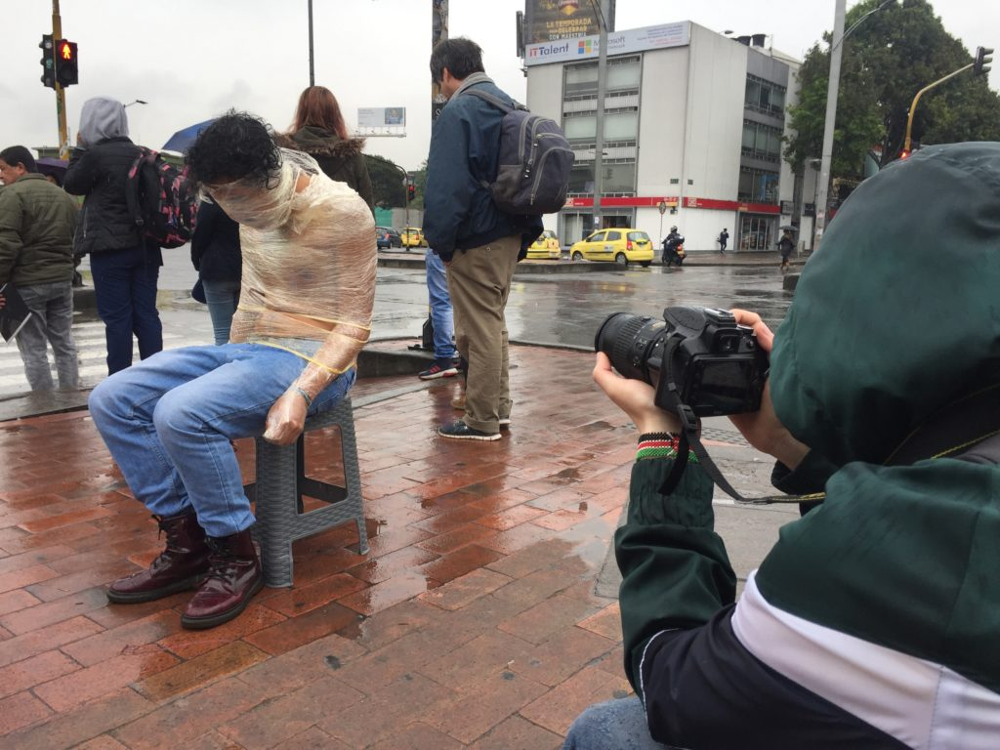
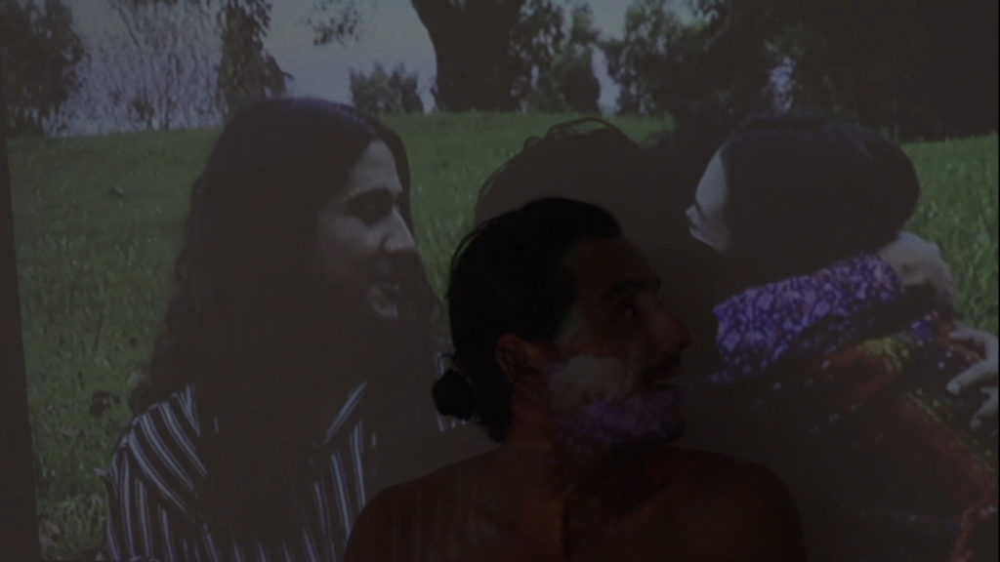

TL: Hi Juan,

If memory serves this is a line in your film, De Gris a POSITHIVO ... 'wrap love in latex?'. I think it is when you are walking in the streets of Bogotá (all wrapped in plastic wrap).

Juan, first, I really appreciate your film, and furthermore it was great to have it privately screened at the [event](https://www.facebook.com/events/675101239678987/) at [El Parche](http://www.elparche.org/) on October 30th in Bogotá. I also really enjoyed being a part of the [Laboratorio Luciérnagas](https://luvhurts.co/coalition/luciernagas/) performance and intervention at the Botanical Gardens on October 25th. The whole trip was amazing for me, and reminded me why I'm making the Luv 'til it Hurts project. 

I understand (I think) the line in your film 'wrap your love in latex' as a question of sorts. I understand the sentiment to be something like this:

_To have contracted HIV means one likely didn't use a condom in that instance. By not wrapping one's love in latex on that occasion, something changes. HIV is passed via semen or blood.  And after that, there is a new prerogative to 'contain' the disease. Like, you may have to 'wrap your love' in order to not pass it further. I find that (even) friends and family can convey guilt to us because we did not generally or on that specific occasion wrap our love (or our dicks) in latex. In some instances it presupposes that we were taking careless risks. Friends and family sometimes take that personally, I've learned. So, I see your statement as a question:_ **_Can we always know to wrap our love before we use it or share it?_**

So, for starters, what did you mean with that line?

JDLM: En primer lugar, para mí es un placer y un verdadero honor comenzar de esta manera nuestra colaboración con Luv ´til it Hurts, una alianza que traspasa fronteras y supera las barreras –inclusive del idioma- que he descubierto, con mi diagnóstico de VIH que no existen. 

¿Cómo forrar en látex el amor? Fue una pregunta que me hice tres días después de recibir el diagnóstico, porque sentía que tenía que protegerme de todo lo que me rodeaba, que estaba en una ciudad llena de bacterias, que hasta el agua que tomaba me podía enfermar (como me lo hicieron entender los médicos); pero también era una protección hacia afuera porque sentía que podía ser peligroso y contaminante para las demás personas y las debía cuidar de mí. Esta sensación fue muy triste porque se interponía en mi intención de compartir el amor y me hacía sentir que ya no podía hacerlo, sentir que tenía que guardarme todo lo que sentía para mí y que no podría compartirlo con nadie más, ni con mi familia, ni con mis amigxs, ni con las personas que me relacionaba sexo-afectivamente.  

Después, con la información que he adquirido y el proceso de dotar de otro sentido y cambiar mi relación con el diagnóstico y con la VIHda misma, sentí necesario compartir esta pregunta con el mundo, porque me parece que vivimos con tanto miedo que siempre nos estamos forrando, protegiendo, conteniendo, estancando, que nuestras relaciones tienen que estar con una bolsa plástica de por medio, y quiero ahora, que no necesariamente sea así. 

TL: And, how was it to be filmed in the streets of Bogotá all wrapped in cellophane? 

JDLM: El cortometraje lo realizamos para la Escuela Nacional de Cine en Bogotá, Colombia. Como yo soy director y personaje principal necesitaba un grupo de trabajo que estuviera muy conectado con la historia y la situación. Yo comencé a comunicarles mis miedos, mis sensaciones y lo que quería transmitir y justo en esos días hicieron un simulacro de evacuación en Bogotá, entonces acudiendo a mi frase de forrar en látex el amor les propuse que me envolvieran en papel de alimentos para caminar por el sector de la ciudad donde estaba el simulacro. 

Fue en verdad extraña la sensación de encierro, porque no podía mover las manos, no veía bien y además había cantidades de personas caminando, observándome, tomándome fotos, sin embargo esa sensación, era la más cercana a lo que sentí el día de mi diagnóstico y me acompañó por lo menos 6 meses después. 

TL: What were the reactions by passers-by? And did you get to talk about HIV and the theme of the film with any curious onlookers?

JDLM: Las personas preguntaban si me había quemado, si estaba enfermo, si me había pasado algo, pero con el equipo decidimos no contestar ninguna de estas preguntas, solo estábamos interviniendo el espacio público. En general, era una reacción de extrañeza, en un momento de por sí muy atípico como es un simulacro cuando las personas no creen que están en ningún riesgo, pero tienen que salir de sus trabajos y alterar su cotidianidad. Después, recuerdo que subimos a Transmilenio (el Sistema de Transporte Público de Bogotá) y nadie se sentaba a mi lado, pero tampoco preguntaban nada. 

TL: I thought that was the brilliant part about the Laboratorio Luciérnagas performance / intervention on the 'free night' at Bogotá's Botanical Gardens. You had hundreds of passers-by ... could you compare a bit the experience of making your film in the public space and being a part of Laboratorio Luciérnagas? 

JDLM: Yo llegué al Laboratorio Luciérnabas dos años después de mi diagnóstico, pero hubiera deseado estar en este espacio desde que comencé mi proceso, de alguna manera era algo que estaba necesitando. La posibilidad de intercambiar conocimientos y hablar con personas que están habitando la situación y la VIHda como lo estoy haciendo yo y que además están cuestionándose sobre otros imaginarios y formas de relacionarse, ha sido muy enriquecedora para mí. Sin embargo, la Noche de las Luciérnagas fue un espacio mucho más acogedor y amigable que el momento en el que caminé forrado en látex, porque ya no me encontraba solo, ahora estaba en un proceso colectivo de intercambio y resonancia de sentires y sanación grupal. Aunque siento que las personas tenían una curiosidad similar y una expectativa que ocurriera algo más allá de lo que estaba pasando. 

TL: I know we can't share the film yet due to film festival competition, so please give us a short description here:

JDLM: De Gris a POSITHIVO, es un documental autobiográfico en el que comparto mi experiencia y la de mi familia cuando me diagnosticaron VIH positivo. Mi miedo a la muerte, la cotidianidad y los momentos complicados del inicio del diagnóstico son contados a través del diario que comencé a escribir 3 días después de esta noticia. Hago parte al expectador de mi viaje de regreso a la VIHda a través de un ritual performance en el que me forro todo el cuerpo en látex para renacer y llenarme de color.

TL: Where do you hope the film will be seen? 

JDLM: Mi mayor deseo es que el documental se pueda ver en los lugares que pueda generar transformación en la mentalidad y el estigma de las personas que viven con VIH, sus familiares y quienes aún no han tenido ningún contacto con el diagnóstico. Con Salmón Producciones (productora documental de Lissette Orozco) estamos buscando un distribuidor con el que podamos hacer una estrategia mixta, para mostrarlo en Festivales de Cine, de Temática LGBT y de Derechos Humanos y en espacios comunitarios, educativos y artísticos en todo el mundo. 

TL: Hey, you brought a colleague from Clínica del Alma Invita to the El Parche event the other night. So glad you did. Wanna tell us more about that place and what it means to you?

JDLM: Siento que el VIH como otras situaciones en la vida te colocan de frente a la pregunta de la muerte y nuestra existencia trascendente, por esto mi proceso artístico y de creación ha estado relacionado con una búsqueda espiritual fuera de iglesias y de cultos religiosos, en este camino encontré Casa Ocho un espacio de terapia alternativa en Bogotá, en donde pude trabajar el miedo a la muerte, mi relación con los límites físicos y la nueva VIHda a la que me estaba enfrentando. Después de este proceso, decidimos crear en este mismo lugar Clínica del Alma, como un espacio de diálogo, contención y compartir en el que vamos a hacer sesiones de escucha entre pares para personas con diagnósticos crónicos (VIH, cáncer), familiares y cuidadores y personal de la salud. Esta iniciativa obedece sobretodo a una necesidad de crear y compartir más espacios en los que sea posible hablar y transformar los imaginarios desde un lugar de experiencia entre personas que nos ha ocurrido la misma situación y hemos encontrado herramientas que nos han ayudado a transformarlas y ahora las queremos compartir.

- 
    
- 
    
- 
    

Image stills of film De Gris a POSITHIVO, provided by director Juan De La Mar.

Synopsis: [http://www.salmonproducciones.com/asesorias-y-alianzas/de-gris-a-posithivo.html](http://www.salmonproducciones.com/asesorias-y-alianzas/de-gris-a-posithivo.html)

Facebook: [https://www.facebook.com/DeGrisAPOSITHIVO/](https://www.facebook.com/DeGrisAPOSITHIVO/)

Instagram: [https://www.instagram.com/degrisaposithivo/](https://www.instagram.com/degrisaposithivo/)

Read also: [Relatory Bogotá](https://luvhurts.co/texts/relatory-bogota/)

\_\_\_\_\_\_\_\_\_\_\_\_\_\_\_\_\_\_\_\_\_\_\_\_\_\_\_\_\_\_\_\_\_\_\_\_\_\_\_\_\_\_\_\_\_\_\_\_\_\_\_\_\_\_\_\_\_\_\_\_\_\_\_

TL: Hi Juan,

If memory serves this is a line in your film, De Gris a POSITHIVO ... 'wrap love in latex?'. I think it is when you are walking in the streets of Bogotá (all wrapped in plastic wrap).

Juan, first, I really appreciate your film, and furthermore it was great to have it privately screened at the [event](https://www.facebook.com/events/675101239678987/) at [El Parche](http://www.elparche.org/) on October 30th in Bogotá. I also really enjoyed being a part of the [Laboratorio Luciérnagas](https://luvhurts.co/coalition/luciernagas/) performance and intervention at the Botanical Gardens on October 25th. The whole trip was amazing for me, and reminded me why I'm making the Luv 'til it Hurts project. 

I understand (I think) the line in your film 'wrap your love in latex' as a question of sorts. I understand the sentiment to be something like this:

_To have contracted HIV means one likely didn't use a condom in that instance. By not wrapping one's love in latex on that occasion, something changes. HIV is passed via semen or blood.  And after that, there is a new prerogative to 'contain' the disease. Like, you may have to 'wrap your love' in order to not pass it further. I find that (even) friends and family can convey guilt to us because we did not generally or on that specific occasion wrap our love (or our dicks) in latex. In some instances it presupposes that we were taking careless risks. Friends and family sometimes take that personally, I've learned. So, I see your statement as a question:_ **_Can we always know to wrap our love before we use it or share it?_**

So, for starters, what did you mean with that line?

JDLM: Firstly, for me it is a pleasure and a true honor to begin our collaboration with Luv ’til it Hurts in this way, an alliance that trespasses borders and overcomes barriers — including language's — that I have come to find out do not exist, through my diagnosis of HIV.

How to wrap love in latex? This was a question that I asked myself three days after receiving the diagnosis, because I felt like I had to protect myself of everything that surrounded me, that I was in a city full of bacteria, that even the water that I drank could make me sick (as doctors made it seem); but it was also a protection towards the outside, because I felt that I could be dangerous and contagious to other people and that I had to be careful with myself. This feeling was very sad because it interposed my intention of sharing love and made me feel like I could not do it, like I had to keep everything that I felt to myself and that I could not share it with anyone else, be it family, or friends, or people with whom I would relate sex-affectively. 

Afterwards, with the information that I had acquired and the process of endowing different senses and changing my relationship with the diagnosis and with HIV itself, I felt it necessary to share this question with the world, because it seems like we live in quite a bit of fear, as we are always wrapping, protecting, containing, sealing. Our relationships have to be with a plastic bag of medicine, and now, I want it to not necessarily be like that.

TL: And, how was it to be filmed in the streets of Bogotá all wrapped in cellophane? 

JDLM: The short film was realized for the Escuela Nacional de Cine en Bogotá, Colombia. Since I am a director and main character, I needed a work group that was very connected with this history and situation. I started to communicate to them my fears, feelings, and what I wanted to transmit. On these same days there was an evacuation drill in Bogotá, so, attending to my phrase of wrapping love in latex, I proposed to them that they wrap me in food wrapping, to walk like that through the part of the city in which the drill was going on. It was actually strange the sensation of being enclosed, because I could not move my hands, I could not see well and also there was a large quantity of people walking, observing me, taking pictures of me. Nevertheless, this sensation was the closest to what I felt on the day of my diagnosis, which followed me for at least 6 months afterwards.

TL: What were the reactions by passers-by? And did you get to talk about HIV and the theme of the film with any curious onlookers?

JDLM: People asked me if I had burnt myself, if I was sick, if something had happened to me, but with the team we decided to not answer any of these questions, we were just intervening in public space. In general, it was a reaction of finding it strange, in a moment that was in itself atypical, such as a drill in which people don’t believe that they are actually under any risk, but have to leave their work and change their routine. Afterwards, I remember that we took a Transmilenio (the Public Transport System of Bogotá) and no one would sit next me, but also no one asked me anything.

TL: I thought that was the brilliant part about the Laboratorio Luciérnagas performance / intervention on the 'free night' at Bogotá's Botanical Gardens. You had hundreds of passers-by ... could you compare a bit the experience of making your film in the public space and being a part of Laboratorio Luciérnagas? 

JDLM: I arrived to Laboratório Luciérnabas two years after my diagnosis, but I would have liked to have been in that space from the beginning of my process, in a way, it was something that I needed. The possibility of exchanging knowledge and talking to people who are inhabiting the situation and life (_VIHda_), as I am, and that are also asking themselves about other imaginaries and ways of relating, has been very enriching to me. Nevertheless, the Noche de las Luciérnagas was a space that was much more welcoming and friendly than the moment when I was walking around in latex, because I didn't find myself alone anymore, I was now in a collective process of exchange, of resonance of feelings, and of group healing. Although I felt that people had a similar curiosity and expectation that something would happen beyond what was happening.

TL: I know we can't share the film yet due to film festival competition, so please give us a short description here:

JDLM: De Gris a POSITHIVO is an autobiographical documentary in which I share my experience and that of my family, when I was diagnosed with being HIV positive. My fear of death, the day to day, and the complicated moments of the beginning of the diagnosis are told through a diary that I began to write 3 days before the news. I am part of the spectators of my journey back to life (_VIHda_) through a performance ritual in which I wrap my entire body in latex to be reborn and to fill myself with color.

TL: Where do you hope the film will be seen? 

JDLM: My biggest wish is for the documentary to be seen in places that can generate transformation in the mentality and stigma of the people who live with HIV, their family members, and those who still have not had any contact with the diagnosis. With Salmón Producciones (Lissette Orozco’s documentary production company) we are looking for a distributer with whom we can have a mixed strategy, to show it at movie festivals, of LGBT and Human Right themes, as well as in community, educative, and artistic spaces all over the world.

TL: Hey, you brought a colleague from Clínica del Alma Invita to the El Parche event the other night. So glad you did. Wanna tell us more about that place and what it means to you?

JDLM: I feel that HIV, like other situations in life, makes you face the question of death and our transcendental existence. That is why my process of art and creation has been related to a spiritual search outside of churches and religious cults, and in this path I have found Casa Ocho, an alternative therapy space in Bogotá, where I could work out my fear of death, my relationship with physical limitations and with a new life (_VIHda_). After this process, we decided to create in the same place the Clínica del Alma, as a space for dialogue, support, and sharing, in which we will do listening sessions in pairs, for people with chronic diagnoses (HIV, cancer), family members and carers, and health practitioners. This initiative obeys above all a necessity to create and share more spaces in which it is possible to speak and transform imaginaries. It departs from a place of experience between people to whom similar situations have happened, as we have found tools that have helped us transform them, and we now want to share.

- 
    
- 
    
- 
    

Image stills of film De Gris a POSITHIVO, provided by director Juan De La Mar.

Synopsis: [http://www.salmonproducciones.com/asesorias-y-alianzas/de-gris-a-posithivo.html](http://www.salmonproducciones.com/asesorias-y-alianzas/de-gris-a-posithivo.html)

Facebook: [https://www.facebook.com/DeGrisAPOSITHIVO/](https://www.facebook.com/DeGrisAPOSITHIVO/)

Instagram: [https://www.instagram.com/degrisaposithivo/](https://www.instagram.com/degrisaposithivo/)

Read also: [Relatory Bogotá](https://luvhurts.co/texts/relatory-bogota/)
