Laboratorio Luciérnagas  
Relatoría 15 junio

sesión #1  
Contexto del cuerpo en las Artes (para artistas y no artistas)

- Escuchamos la pieza sonora de John Cage “canción para Marcel Duchamp”.

- Hicimos cuadernos de notas para tomar anotaciones.

- ¿Por qué del laboratorio? Lineamientos.

- Cada uno habló de cómo se relaciona con los contenidos del laboratorio  
    

**Contexto del cuerpo en las artes:**

  
Body art, Arte Conceptual, Performance, Danza, otros. El cuerpo como material.

  
**Bruce Nauman** (USA, 1941) es artista multimedia estadounidense,

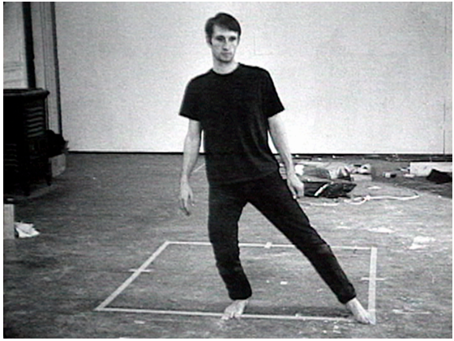

  
**Yves Klein** (1928 - 1962) fue un artista francés considerado como una importante figura dentro del movimiento neodadaísta.

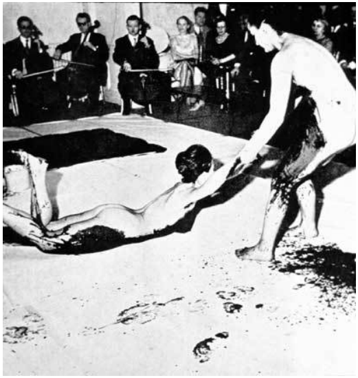

  
**Fluxus** es un movimiento artístico de las artes visuales en especial, pero también de la música, la literatura y la danza. Tuvo su momento más activo entre la década de los 60 y los 70 del siglo XX.

  
Estos fueron algunos de los miembros más importantes de **Fluxus**: George Maciunas, John Cage, Arman, Alan Kaprow, Joseph Beuys, Charlotte Moorman, George Brecht, Dick Higgins, Yoko Ono, Daniel Spoerri, Wolf Vostell y Robert Watts, entre otros.

  
Como Dada, FLUXUS escapó de toda definición y categorización.

  
Robert Filliou dice de FLUXUS: es un estado del espíritu, un modo de vida con soberbia libertad de pensar, expresar, elegir.

  
FLUXUS disuelve el arte en lo cotidiano.

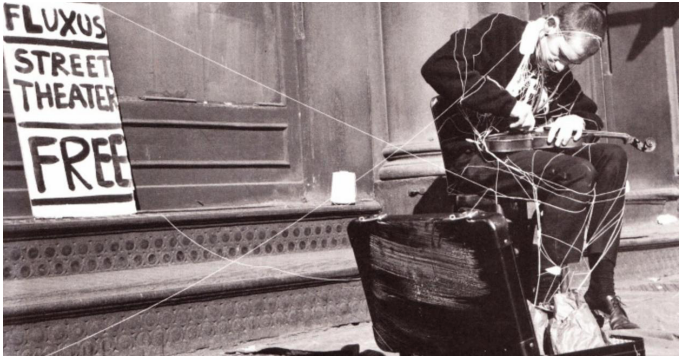

  
**John Cage** (Los Ángeles, 1912 - Nueva York, 1992) fue un compositor, instrumentista, filósofo, teórico musical, poeta, artista, pintor, aficionado a la micología y recolector de setas estadounidense. Pionero de la música aleatoria, de la música electrónica y del uso no estándar de instrumentos musicales, Cage fue una de las figuras principales  
del avant garde de posguerra.

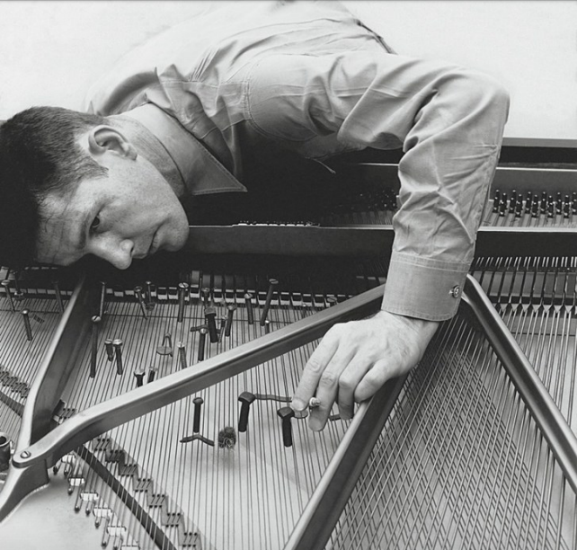

  
**Merce Cunninham & John Cage**

  
**Merce Cunningham** (Centralia, 1919 - Nueva York, 2009) fue  
un bailarín y coreógrafo estadounidense.

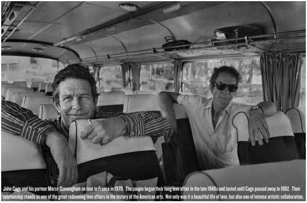

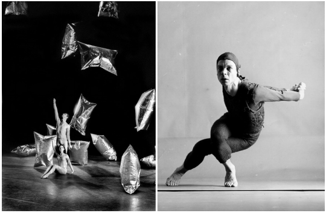

  
**Marina Abramović** artista serbia del performance que empezó su carrera a comienzos de los años 1970. Activa durante más de tres décadas, recientemente se ha descrito a sí misma como la "Madrina del arte de la performance".  

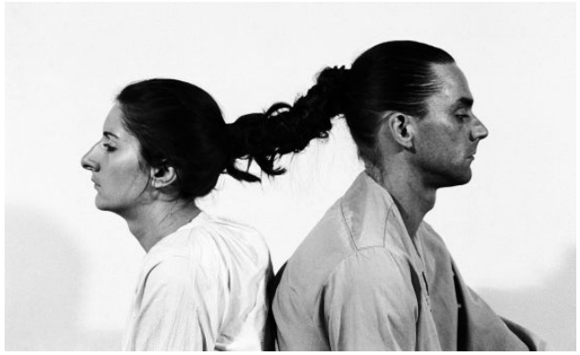

**Martha Graham** (Pittsburgh, 1894 — Nueva York, 1991) fue una bailarina y coreógrafa estadounidense de danza moderna.

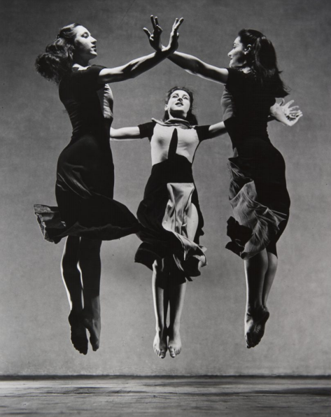

  
**Pina Bausch** (Solingen 1940-Wuppertal, 30 de junio de 2009), fue una bailarina, coreógrafa y directora alemana pionera en la danza contemporánea.

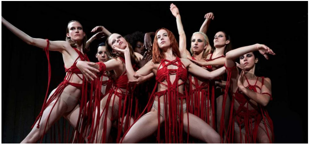

  
**Cindy Sherman** ( EUA, de 1954) es una fotógrafa y directora de cine estadounidense.

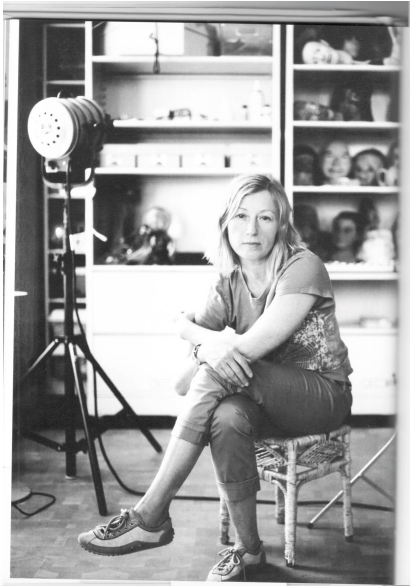

  
**Pipilotti Rist** (1962, Suiza) es una reconocida videoartista.

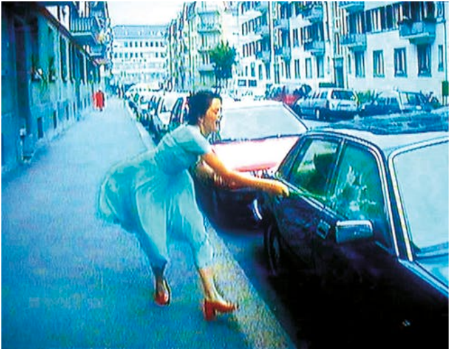

  
**Sophie Calle** (París, 1953) es una escritora, fotógrafa, directora y artista conceptual francesa. El principal objeto de su obra es la intimidad y de modo particular la suya propia. Para ello utiliza gran diversidad de medios de registro como libros, fotografías, vídeos, películas o performances.

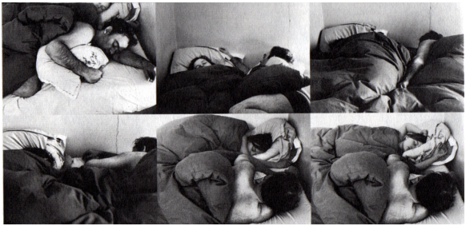

  
**Contexto cuerpo artes Latinoamérica:**

  
**Pedro Lemebel** (Santiago, 1952- ibídem, 23 de enero de 2015) fue un escritor, cronista y artista plástico chileno.

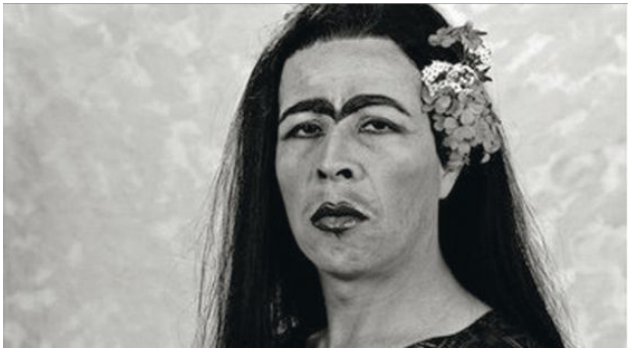

  
**Hélio Oiticica** (Río de Janeiro, 1937 - 1980) fue uno de los artistas plásticos brasileños más innovadores del siglo XX y actualmente es reconocido como una figura clave en el desarrollo del arte contemporáneo..

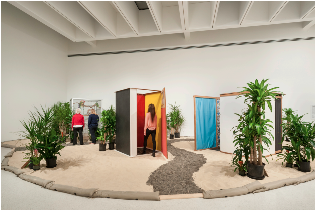

  
**Lygia Clark** (Belo Horizonte 1920 - Río de Janeiro 1988) fue una artista brasileña, co-fundadora del Movimiento Neoconcreto, comprometida con redefinir la relación entre el arte y el ser humano a nivel conceptual y sensorial. Realizó pinturas, esculturas y acciones sensoriales vinculadas al arte y a la psicoterapia.

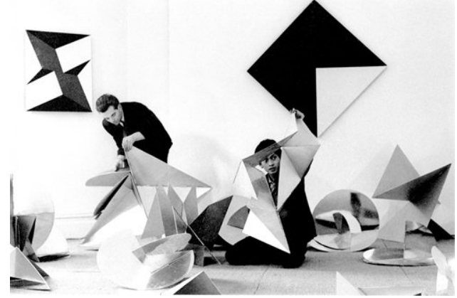

  
**María Teresa Hincapié** (Armenia, Colombia, 1956 - Bogotá, Colombia, 2008) fue una artista de expresión de danza corporal y performance colombiana.

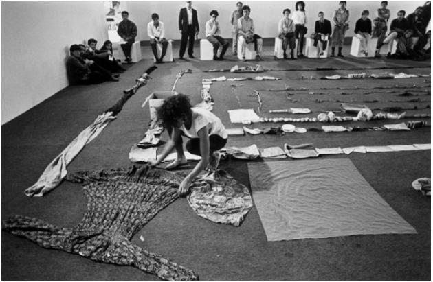

  
**María Evelia Marmolejo** Cali 1958. Es una artista feminista colombiana radical, más tarde con sede en Madrid y la ciudad de Nueva York. Se le atribuye la primera obra escénica de performance feminista en Colombia, en 1981

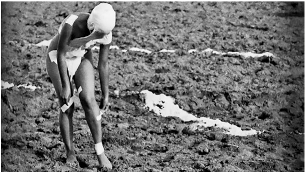

  
**Helena producciones:**  
www.helenaproducciones.org

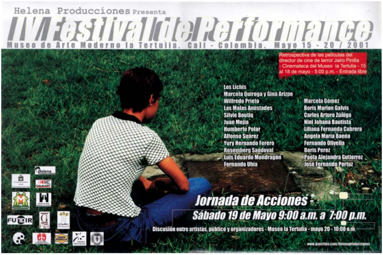

  
**María José Arjona** (Colombia, 1973)  
María José Arjona es considerada la artísta performática más importante de Colombia. Ha llevado su trabajo a Italia, Alemania, Austria, entre otros países.

  
**“El arte debe volver a darle valor al cuerpo femenino”**

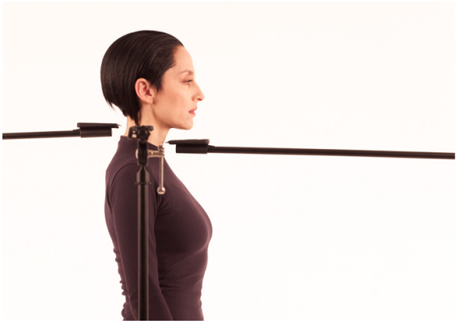

  
**Regina José Galindo** (Ciudad de Guatemala, 1974) es una artista  
visual, performer y poeta guatemalteca especializada en body-art. Su obra se caracteriza por su explícito contenido político, reconociéndose a sí misma como feminista.

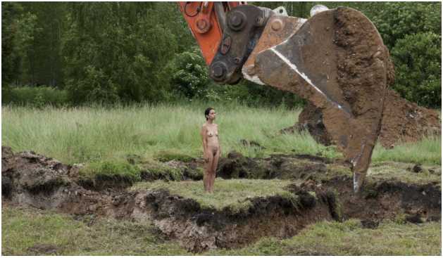

  
Ana Mendieta (La Habana 1948 – Nueva York 1985) fue una artista conceptual, escultora, pintora y videoartista nacida en Cuba y criada en Estados Unidos. Es especialmente reconocida por sus obras de arte y performances en el marco del land art (arte terrestre).

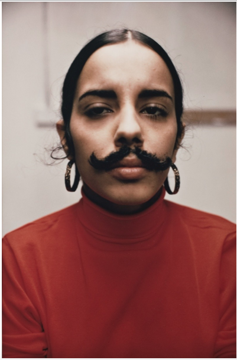

  
**Francis Alÿs** es un artista multidisciplinario nacido en Amberes, Bélgica en 1959. Vive y trabaja en la Ciudad de México desde 1986.

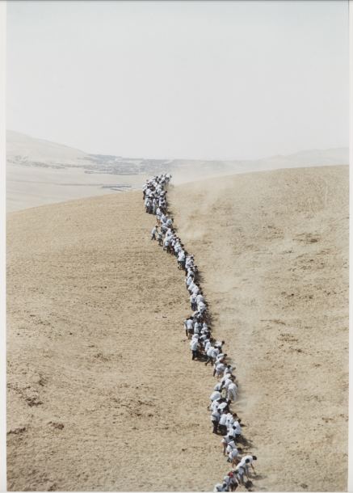

  
**José Esteban Muñoz** (1967 – 2013) fue un académico norteamericano de nacionalidad cubana en los campos de estudios de rendimiento, cultura visual, teoría queer, estudios culturales, y teoría crítica. Su primer libro, _Disidentifications: Queers of Color and the Performance of Politics_ (1999) examina la performatividad, activismo, y supervivencia de las personas queer y minorías étnicas a través de la óptica de estudios de performatividad.

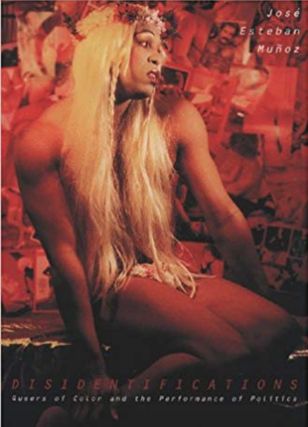

  
**Rafa Esparza** (born in 1981)

Rafa Esparza es una artista de performance estadounidense que vive en Los Ángeles. Su trabajo a menudo toma la forma de actuaciones físicamente exhaustivas e instalaciones construidas con ladrillos de adobe.

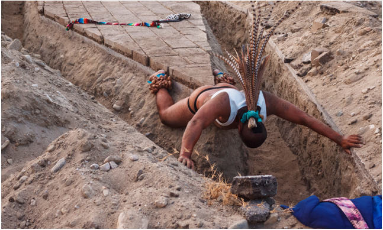

  
Los siguientes nombres y conceptos fueron sugeridos por los participantes del laboratorio:

  
**Astrid Hadad** (n. Chetumal, 26 de febrero de 1957) es una actriz, cabaretera, y cantautora mexicana de ascendencia mayalibanesa. Es creadora del _heavy nopal_ o _neo ranchero_, un estilo de performance musical de fusión que caracteriza sus presentaciones

  
**Sergio Zevallos**: 1962 en Lima, Perú. Reside en Berlin, Alemania. Pertenecía al grupo Chaclayo.

  
**Jesusa Rodríguez Ramírez** (Ciudad de México, 1955) es una directora de teatro, actriz, artista de performance y actualmente Senadora de la República Mexicana por el partido Morena.

  
**Mapa Teatro**. compañía de teatro contemporáneo y artes visuales, Bogotá.

  
**Nadia Granados** 1978 Bogotá. Artista de performance colombiana que usa su cuerpo en combinación con tecnologías multimedia para explorar las relaciones entre la representación de la violencia estatal.

  
• Las notas, fechas e informaciones de los artistas fueron obtenidas de google y Wikipedia en su mayoría.

\_\_\_\_\_\_\_\_\_\_\_\_\_\_\_\_\_\_\_\_\_\_\_\_\_\_\_\_\_\_\_\_\_\_\_\_\_\_\_\_\_\_\_\_  
  

Luciérnagas Lab  
June 15th report

session #1  
The context of the body in the arts (for artists and non-artists)

- We listened to John Cage’s sound piece “Music for Marcel Duchamp” 

- We made notebooks to take notes on.

- Why the lab? Guidelines.

- Each one spoke of how he/she relates to the contents of the lab.  
    

**The context of the body in the arts:**

Body art, Conceptual art, Performance, Dance, others. The body as material.

**Bruce Nauman** (USA, 1941) is a multimedia artist from the United States.

  
**Yvez Klein** (1928 - 1962) was a French artist, considered an important figure in the neodadaist movement.

  

**Fluxus** is an artistic movement in the visual arts in particular, but also of in music, literature, and dance. It had its most active moment between the decade of the 60s and 70s of the 20th century.

These were some of the most important **Fluxus** members : George Maciunas, John Cage, Arman, Alan Kaprow, Joseph Beuys, Charlotte Moorman, George Brecht, Dick Higgins, Yoko Ono, Daniel Spoerri, Wolf Vostell and Robert Watts, among others.

Like Dada, FLUXUS escaped from all definition and categorization.  

Robert Filliou says about FLUXUS: a spiritual state, a way of life with superb freedom of thought, expression, and election.

FLUXUS dissolves art into the everyday.  

  
**John Cage** (Los Angeles, 1912 - New York, 1992) was a composer, instrumentalist, philosopher, music theorist, poet, artist, painter, mycology enthusiast, and collector of mushrooms from the United States. Pioneer of aleatoric music, electronic music, and non-standard uses of musical instruments, Cafe was one of the main figures of the post-war avant-garde. **J**

  
**Merce Cunninham & John Cage**  

**Merce Cunningham** (Centralia, 1919 - New York, 2009) was a dancer and choreographer from the United States.

  
**Marina Abramovic** is a Serbian performance artist who started her career in the beginning of the 1970s. Active for more than three decades, she has recently described herself as the “Godmother of performance art.”  

**Martha Graham** (Pittsburgh, 1894 — New York, 1991) was a modern dance dancer and choreographer from the United States.

  
**Pina Bausch** (Solingen 1940-Wuppertal, June 30th 2009), was a dancer, choreographer and German director pioneer in contemporary dance.

  
**Cindy Sherman** (USA, 1954) is a photographer and movie director from the United States.

  
**Pipilotti Rist** (1962, Switzerland) is a recognized video artist.

  
**Sophie Calle** (Paris, 1953) is a French writer, photographer, director and conceptual artist. The main subject of her works is intimacy and, in particular, her own. She makes use of a great diversity of mediums for recording, such as books, photography, videos, movies, or performances.

  
**Latin America body arts context:**

  
**Pedro Lemebel** (Santiago, 1952 - Ibídem, January 23 of 2015) was a Chilean writer, chronicler and artist.

  
**Hélio Oiticica** (Rio de Janeiro, 1937 - 1980) was one of the most innovating Brazilian artists of the 20th century, and is currently recognized as a key figure in the development of contemporary art..

  
**Lygia Clark** (Belo Horizonte 1920 - Rio de Janeiro 1988) was a Brazilian artist, co-founder of the Neoconcrete Movement, committed to redefining the relationship between art and human beings, in a conceptual and sensorial level. She realized a lot of paintings, sculptures, and sensorial actions related to art and psychotherapy.

  
**María Teresa Hincapié** (Armenia, Colombia, 1956 - Bogotá, Colombia, 2008) was a Colombian artist of body dancing expression and performance.

  
**María Evelia Marmolejo** Cali 1958. Is a radical Colombian feminist artist, later based in Madrid and New York City. The first scenic work of feminist performance in Colombia is attributed to her, in 1981

  
**Helena producciones:**  
www.helenaproducciones.org

  
**María José Arjona** (Colombia, 1973)

María José Arjona is considered the most important performance artist in Colombia. She has taken her work to Italy, Germany, Austria, among other countries.

**“ art must go back to giving value to the female body”**

  
**Regina José Galindo** (Guatemala City, 1974) is a Guatemalan visual artist, performer, and poet, specialized in _body-art._ Her work is characterized by its explicit political content, recognizing herself as a feminist. 

  
**Ana Mendieta** (La Habana, 1948 — New York 1985) was a conceptual artist, sculptor, painter and video artist  born in Cuba and raised in the United States. She is especially recognized for her works of art and performances within the context of land art.

  
**Francis Alys** is a multidisciplinary artist born in Antwerp, Belgium in 1959. He lives and works in Mexico City since 1986.

  
**José Esteban Muñoz** (1967 — 2013) was a North American academic of Cuban nationality in the fields of performance, visual culture, queer theory, cultural studies, and critical theory. His first book, _Disidentifications: Queers of Color and the Performance of Politics_ (1999) examines performativity, activism, and survival of queer people and ethnic minorities, through the optics of performance studies. 

  
**Rafa Esparza** (born in 1981)

Rafa Esparza is a performance artist from the United States who lives in Los Angeles. His work often takes the shape of physically exhausting actions and installations built with adobe tiles. 

The following names and concepts were suggested by the lab’s participants:

**Astrid Haddad** (b. Chetumal, February 26th of 1957) is a Mexican actress, cabaret dancer, and singer-songwriter of Mayan-Lebanese descent. She is the creator of _heavy nopal_ or _neo ranchero_, a style of fusion musical performance that characterizes her presentations.

**Sergio Zevallos**: 1962 in Lima, **Peru**. He lives in Berlin, Germany. He belonged to the Chaclayo group.

**Jesus Rodriguez Ramírez** (Mexico City, 1955) is a theater director, actress, performance artist and currently Senator of the Mexican Republic for the Morena party. 

**Mapa Teatro.** contemporary theatre company and visual arts, Bogotá.

**Nadia Granados** 1978 Bogotá. Colombian performance artist who uses her body in combination with multimedia technologies to explore the relationships between the representation of state violence.

  
• The majority of the artists’ notes and informations were obtained from google and Wikipedia.
